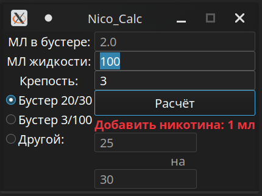

# NicoCalk

Калькулятор для расчёта крепости жидкости для вейпа.  
  

## Зависимости  
- .NET 7 SDK  

## Сборка в Linux  
Для кросплатформенной сборки:  
```make publish```  
Компиляция с возможностью запустить файл на компьютере под управлением ОС на базе Linux без установленной среды выполнения dotnet:  
```make publish-self-contained```  

## Сборка в Windows  
Для кросплатформенной сборки:  
```dotnet publish --configuration Release -p:PublishSingleFile=true --no-self-contained```  
Компиляция с возможностью запустить файл на компьютере под управлением Windows без установленной среды выполнения dotnet:  
```dotnet publish --configuration Release --runtime win-x64 --self-contained -p:PublishSingleFile=true -p:EnableCompressionInSingleFile=true```  
